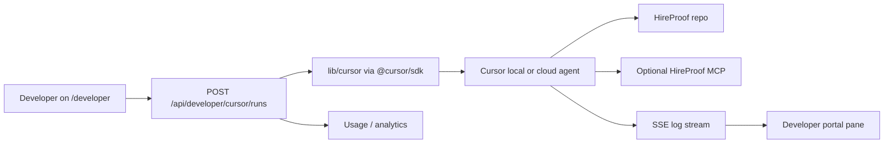

# Cursor TypeScript SDK (developer portal)

**Status:** Spec / Phase 2 — routes and `@cursor/sdk` are not in this repo yet. Use this page for intended design and example prompts.

## Goal

Expose **optional** Cursor agent runs from `/developer` so builders can scaffold integrations, review docs drift, or run safe repo tasks—without routing end-user audits through Cursor.

## Target flow



## Security (match existing developer routes)

- Reuse patterns from `app/api/developer/provider-credentials`: origin validation, rate limits, authenticated session.
- **BYOK:** Store user Cursor keys in the existing encrypted provider vault (`BYOK_ENCRYPTION_KEY`), never log raw keys.
- **Feature flag:** e.g. `NEXT_PUBLIC_CURSOR_AGENTS_ENABLED=false` until QA passes.
- **Repo pin:** `CURSOR_ALLOWED_REPO_URL` fixed to this repository—no arbitrary repo targets from user input.

## Environment variables (Phase 2+)

| Variable | Purpose |
| --- | --- |
| `CURSOR_API_KEY` | Platform-managed runs (server-side only) |
| `CURSOR_MODEL_ID` | Configurable model id |
| `CURSOR_RUNTIME_DEFAULT` | `local` \| `cloud` \| later `self-hosted` |
| `CURSOR_WEBHOOK_SECRET` | Internal cron / webhook auth |
| `CURSOR_MAX_CONCURRENT_RUNS` | Spend and contention cap |

## Degradation

When the key is missing or Cursor is down:

- Show static docs and example prompts (below).
- Keep the existing API playground as the primary integration path.

## Example prompts (copy into Cursor or future portal presets)

**Generate Next.js integration**

```text
Read app/docs/headless-api and lib/schemas.ts. Propose a minimal Next.js App Router example that calls POST /api/v1/audit with x-api-key from env. Do not weaken origin or SSRF patterns from existing routes.
```

**Docs / env drift review**

```text
Compare README.md, DEPLOYMENT.md, .env.example, and docs/automation-integrations.md for stale routes, env vars, or API examples. List mismatches only; propose minimal doc fixes in a separate branch.
```

**Security-focused diff review (local agent)**

```text
Review the current branch diff under app/api/ and lib/ for: SSRF on user URLs, weakened rate limits, secret logging, demo-vs-live disclosure regressions. Cite file paths; do not change product verdict logic.
```

## References

- Cursor TypeScript SDK: [cursor.com/blog/typescript-sdk](https://cursor.com/blog/typescript-sdk)
- HireProof developer portal: `/developer`
- Phase 1 config: [bugbot.md](./bugbot.md), [mcp.md](./mcp.md)
