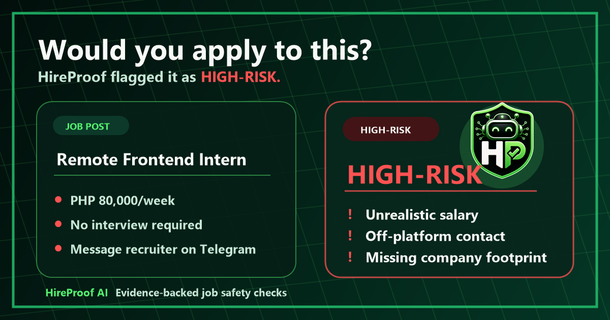

# HireProof UI/UX Case Study

## Project

HireProof is a proof-backed job scam verification interface built solo by Mark Siazon in about one week for a global hackathon.

Recommended visuals:

## UX Goal

The interface has one main job: help a user decide whether a suspicious job opportunity is safe enough to trust.

The UX therefore prioritizes:

- Quick input.
- Clear verdict.
- Visible evidence.
- Practical next steps.
- Honest boundaries between live checks, demo fixtures, and missing credentials.

## Main User Flow

1. User arrives with a suspicious job post, recruiter message, screenshot, or apply link.
2. User submits it through the audit flow.
3. The product extracts role, company, pay, location, contact method, and apply path signals.
4. The report returns Safe, Caution, or High-Risk.
5. The user scans red flags, green flags, evidence cards, and next steps.
6. The user can share, export, or use a safer alternative if verified evidence exists.

## Information Architecture

The interface separates the decision into layers:

| Layer | Purpose |
| --- | --- |
| Verdict | Immediate answer for the user. |
| Score | Severity indicator that supports the verdict. |
| Red flags | The strongest reasons to be careful. |
| Green flags | Evidence that reduces risk. |
| Evidence cards | Source-level proof and context. |
| Next steps | Practical user actions. |
| Exports | Off-platform proof for review or reporting. |

## Interaction Design

The product avoids hiding the result behind a conversation. The audit flow feels like an investigation workspace:

- Paste or upload first.
- Run the check.
- Watch evidence collection progress.
- Review a structured report.
- Export or share the proof.

This is intentional. For safety decisions, users need a report they can scan, not only a chat response they must interpret.

## Visual Design Choices

- The verdict is visually dominant because it answers the user's immediate question.
- Evidence sections use structured cards so a user can scan rather than read every paragraph.
- Red and green signals are separated so risk and reassurance do not blur together.
- Technical proof exists in docs and developer pages, but the main product keeps the user focused on the job opportunity.
- Product screenshots and social graphics use the actual app state, not abstract decoration.

## Responsive UX

The interface was checked across small mobile, mobile landscape, tablet, desktop, and wide desktop during the responsive audit pass.

Responsive priorities:

- No horizontal page overflow.
- Navigation, drawer, search, buttons, and docs surfaces remain usable.
- Audit input and report sections stay readable on small screens.
- Wide layouts use space for evidence density instead of oversized marketing sections.
- Docs horizontal scroll areas remain intentional and usable.

## Accessibility And Trust

Trust is not only visual polish. The interface also needs predictable controls and readable states:

- Buttons use direct action labels.
- Risk copy avoids vague fear language.
- Demo and provider boundaries are labeled.
- Report sections remain understandable without needing implementation knowledge.
- Exports and share links support off-platform review.

## UX Tradeoffs

| Tradeoff | Decision |
| --- | --- |
| Marketing landing page vs usable app | Put the working audit flow close to the first experience. |
| Dense proof vs simple answer | Use a clear verdict first, then expandable/scannable proof. |
| Platform breadth vs user clarity | Keep the main UX focused on the job seeker and move technical breadth to docs. |
| Visual drama vs trust | Use product screenshots and evidence visuals over abstract decoration. |

## Portfolio Summary

HireProof's UX is designed around an anxious user moment: "Should I trust this job before I apply?" The interface turns that uncertainty into a clear verdict with proof, while still allowing deeper review through evidence cards, exports, docs, and developer surfaces.

