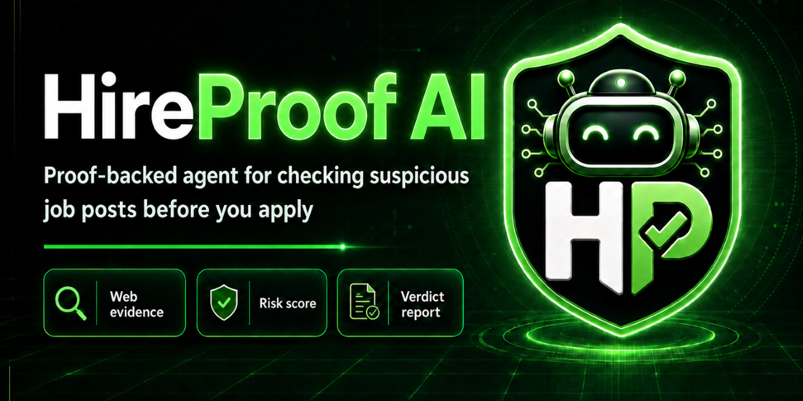

# HireProof Promo Post Drafts

Local drafts for post-submission promotion. Keep links current before posting.

## Primary Links

[Live Demo](https://hireproof-sigma.vercel.app/audit) |
[Repository](https://github.com/Iron-Mark/hackathon-v0-zero_to_agent) |
[v1.0 Release](https://github.com/Iron-Mark/hackathon-v0-zero_to_agent/releases/tag/v1.0) |
[Packages](https://github.com/Iron-Mark?tab=packages&repo_name=hackathon-v0-zero_to_agent) |
[Portfolio](https://www.marksiazon.dev/)

Recommended opening image:

## Short Product Line

HireProof checks suspicious job posts, recruiter messages, screenshots, and apply links before someone applies or shares personal data.

## LinkedIn - Portfolio Launch

I built HireProof solo for the Vercel Zero to Agent global hackathon in about one week.

It is a proof-backed job scam verification agent: paste a job post, recruiter message, screenshot, or apply link, and it returns a Safe, Caution, or High-Risk verdict with visible evidence, red flags, green flags, and next steps.

What I wanted to prove:

- Product design: turn an anxious, high-risk job-seeker moment into a clear trust decision.
- UI/UX: make the evidence readable, not hidden behind a generic chatbot answer.
- Engineering: ship the same verification core across web, API, MCP, ChatSDK, WDK, CLI, SDK, n8n, LangChain, and a Chrome extension package.

This was built under solo hackathon pressure, but I treated it like a real production product: live demo, release assets, package workflow, cost-safety controls, and documentation that still makes sense after the competition.

Live demo: https://hireproof-sigma.vercel.app/audit

Repo: https://github.com/Iron-Mark/hackathon-v0-zero_to_agent

## LinkedIn - Recruiter And Client Focus

HireProof is my solo global hackathon build: a production-deployed AI agent for checking suspicious job opportunities before someone trusts them.

The product focuses on employment fraud because job scams are urgent, personal, and expensive. A user can paste a job post, recruiter pitch, screenshot, or URL, then get an evidence-backed verdict with the reasoning shown.

From a portfolio angle, this project shows product thinking, interface design, full-stack implementation, AI agent orchestration, integration packaging, and launch discipline in one shipped system.

Built by Mark Siazon in about one week.

Live demo: https://hireproof-sigma.vercel.app

## X / Twitter - Launch

I built HireProof solo for a global hackathon in about one week.

Paste a suspicious job post, recruiter message, screenshot, or apply link. HireProof checks evidence and returns Safe, Caution, or High-Risk with proof.

Live demo: https://hireproof-sigma.vercel.app/audit

## X / Twitter - Builder Thread

1/ I built HireProof solo for the Vercel Zero to Agent global hackathon.

It helps job seekers verify suspicious job posts before applying or sharing personal data.

2/ The core flow is simple:

Paste a job post, recruiter message, screenshot, or URL. HireProof extracts claims, checks evidence, and returns Safe, Caution, or High-Risk.

3/ The product design goal was not "another chatbot."

The verdict has to be explainable: red flags, green flags, source receipts, safer next steps, and honest provider boundaries.

4/ The same verification core is exposed across:

Web, API, MCP tools, ChatSDK routes, Vercel Workflow, CLI, SDK, n8n, LangChain, and a Chrome extension package.

5/ Built by Mark Siazon in about one week as a solo global hackathon project.

Live demo: https://hireproof-sigma.vercel.app/audit

## Discord / Community

I built HireProof for the Vercel Zero to Agent global hackathon.

It checks suspicious job posts, recruiter messages, screenshots, and apply links before someone applies. The result is a Safe, Caution, or High-Risk verdict with visible evidence, red flags, and next steps.

The goal is simple: help job seekers avoid scams before they send money, IDs, resumes, or personal data.

Live demo: https://hireproof-sigma.vercel.app/audit

## GitHub Release Follow-Up

HireProof v1.0 is live.

This release packages the project as more than a hackathon demo: production app, proof-backed audit flow, documentation, package workflows, release graphics, CLI, SDK, n8n, LangChain, MCP/API surfaces, ChatSDK routes, WDK route, and Chrome extension package.

Built solo by Mark Siazon for a global hackathon in about one week.

Release: https://github.com/Iron-Mark/hackathon-v0-zero_to_agent/releases/tag/v1.0

## Portfolio Website Card

### HireProof

Proof-backed job scam verification agent for suspicious job posts, recruiter messages, screenshots, and apply links.

Built solo by Mark Siazon in about one week for a global hackathon. The project combines product design, UI/UX, full-stack engineering, AI agent tooling, package distribution, and production launch readiness.

[Open Live Demo](https://hireproof-sigma.vercel.app/audit) |
[View Repository](https://github.com/Iron-Mark/hackathon-v0-zero_to_agent)

## Visual Pairings

Use these with posts:

- Social hero: `public/social/github-social-preview-1280x640.png`
- Wide launch image: `public/social/hireproof-x-1600x900.png`
- Architecture proof: `public/technical_architecture_fraud_v2.png`
- Product risk preview: `public/og-high-risk-demo.png`
- CLI proof: `public/cli-tui-screenshot.png`
- Extension proof: `docs/chrome-web-store-assets/screenshot-02-popup-result-1280x800.png`

